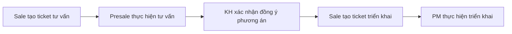
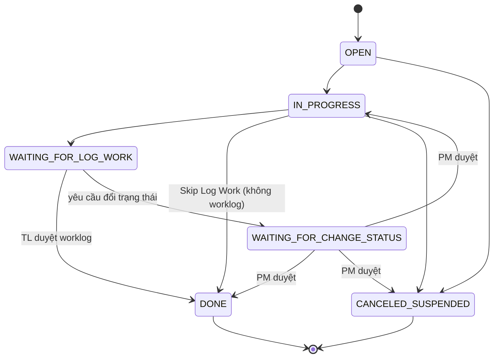
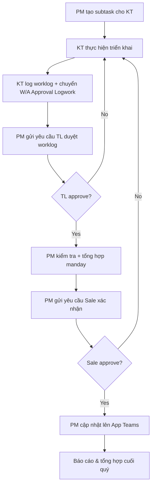

# Quy trình triển khai Cloud Project (FPT Cloud)

> **Nguồn:** Wiki FCI — [3.3.1 Cloud Project](https://wiki.fci.vn/display/CDC/3.3.1+Cloud+Project)
>
> **Created by:** Nguyễn Văn Tuấn — **Last modified:** Jun 15, 2026

---

## Mục lục

1. [Hiện trạng](#1-hiện-trạng)
2. [Workflow luồng tư vấn & triển khai](#2-workflow-luồng-tư-vấn--triển-khai)
3. [Chi tiết workflow ticket triển khai trên Servicedesk (SD)](#3-chi-tiết-workflow-ticket-triển-khai-trên-servicedesk-sd)
4. [Chi tiết workflow subtask triển khai trên Servicedesk (SD)](#4-chi-tiết-workflow-subtask-triển-khai-trên-servicedesk-sd)
5. [Đầu mối xin nhân sự triển khai](#5-đầu-mối-xin-nhân-sự-triển-khai)
6. [Quy trình tính manday triển khai](#6-quy-trình-tính-manday-triển-khai)
7. [Cách tính tổng manday dự án và từng kỹ thuật](#7-cách-tính-tổng-manday-dự-án-và-từng-kỹ-thuật)

---

## 1. Hiện trạng

- Quy trình triển khai FPT Cloud mới nhất đã ban hành tháng 7.2025 trên QMS: [Xem chi tiết](https://qms.fpt.com/document-detail/4baf774f-6127-4288-bc5e-7aa945d13b9b/view)
- PM team đang pilot workflow triển khai dự án mới trong Q1.2026, dự kiến tháng 3/2026 sẽ cập nhật version mới.

---

## 2. Workflow luồng tư vấn & triển khai



1. **Sale** tạo ticket tư vấn.
2. **Presale** thực hiện tư vấn theo workflow tư vấn.
   - Output: Proposal (yêu cầu khách hàng, phương án FCI: topology, survey, v.v.).
3. **Khách hàng** xác nhận đồng ý phương án đề xuất.
4. **Sale** tạo ticket triển khai, ticket yêu cầu cấp thêm tài nguyên (nếu cần).
5. **PM** thực hiện triển khai theo workflow triển khai.

### Tồn đọng

- Tạo song song ticket tư vấn & triển khai → ticket triển khai có thể bị pending vì chưa hoàn tất tư vấn hoặc sau tư vấn KH không tiếp tục PoC/Commercial.
- Chưa có techlead nên một số yêu cầu triển khai thêm của KH cũ vẫn cần tư vấn hỗ trợ → Sale không tạo ticket tư vấn.

---

## 3. Chi tiết workflow ticket triển khai trên Servicedesk (SD)

> Workflow cải tiến đã release trên SD tháng 4/2026.
>
> File workflow gốc: `Project Deployment_v1.1.drawio`

| Bước | Trạng thái | Mô tả | SLA |
|------|-----------|-------|-----|
| **1** | **Create ticket deployment** | Requester (Sale, KH FCI AI, phòng ban nội bộ Cloud) tạo ticket triển khai theo template. [Link tạo ticket](https://servicedesk.fci.vn/servicedesk/customer/portal/5/create/259) | N/R |
| **2** | **Waiting for PM** | Chờ PM tiếp nhận. SLA sẽ dừng nếu ticket được assign PM. | PM SLA: **1 giờ làm việc** từ khi tạo ticket |
| **3** | **Kickoff** | PM yêu cầu các bên tham gia kickoff làm rõ thông tin dự án. | Không đặt SLA trên ticket |
| | | **Presale:** Cung cấp thông tin, trình bày yêu cầu KH, phương án triển khai (topology, dịch vụ, survey...). Có thể cung cấp SOW draft. | |
| | | **PM:** Xin nhân sự triển khai, yêu cầu KT tham gia kickoff, tạo folder dự án trên SharePoint (CDC + FTI nếu cần), cung cấp template SOW. | |
| | | **Sale:** Tham gia họp kickoff, cung cấp thông tin yêu cầu, lưu ý. | |
| | | **KT triển khai:** Tham gia họp kickoff nắm thông tin. | |
| **4** | **Draft Technical SOW** | Presale cung cấp SOW draft (nếu có). PM đưa file SOW lên folder chung. KT hoàn thành cập nhật SOW. PM review, format, hoàn thiện. PM gửi SOW cho KH review scope, timeline. | N/A |
| **5** | **Customer Review SOW** | PM trao đổi SOW với KH. | N/A |
| | | **Case 1 — Có scope triển khai của KT FCI:** | |
| | | - KH đồng ý: PM chụp evidence, up lên comment ticket, tạo task triển khai → chuyển sang **Task In Progress**. | |
| | | - KH không đồng ý: PM trao đổi nội bộ vs KT/Presale cập nhật. | |
| | | **Case 2 — KH tự triển khai (self service):** | |
| | | - KH đồng ý: KH tự triển khai. FCI L1 hỗ trợ khi có yêu cầu. PM chuyển sang **PM HO to Operations**. | |
| | | - KH không đồng ý: PM trao đổi nội bộ cập nhật. | |
| **6** | **Task In Progress** | KT triển khai task theo yêu cầu. KT resolve task khi xong và log work. PM kiểm tra trạng thái subtask, logwork, tổng manday. Cập nhật SOW. | N/A |
| **7** | **Customer Verification** | PM bàn giao cho KH: SOW, Topology, Account, tài liệu hãng, quy trình HTKT, training/demo. | N/A |
| | | - KH không đồng ý → PM tạo task cho KT, chuyển lại **Task In Progress**. | |
| | | - KH đồng ý → PM thu thập evidence (chat, email), chụp ảnh lên ticket. | |
| **8** | **PM HO To Customer & Operations** | PM bàn giao thông tin sau triển khai cho Operations (L1, L2/MSD, CSO) và KH. | N/A |
| | | **Hình thức:** Gửi email, title `[PM-MSD][ORG KH] Bàn giao thông tin dự án sau triển khai`. | |
| | | **To:** CSO group (`FCI.Cloud.Support`) | |
| | | **CC:** PM group (`FCI.CDC.PM`) và Sale dự án | |
| **9** | **TL Review Worklog** | PM yêu cầu Team Lead review worklog. Hệ thống gửi email tự động từ `fci.support` tới TL và cc PM. | TL SLA: **8 giờ làm việc** từ khi gửi email |
| | | **Nội dung email yêu cầu duyệt:** | |
| | | ```
| | | Title: [CDC][Manday Approval Request][Ticket X]
| | | Dear Ticket Requester,
| | | Team kỹ thuật đã hoàn tất các hạng mục triển khai...
| | | Deployment Ticket: X
| | | Total Manday: Y
| | | SLA for Approval: 24 giờ làm việc...
| | | ``` |
| | | **Sau khi duyệt:** Hệ thống gửi email thông báo `[CDC][Manday Approved][Ticket X]`. | |
| **10** | **PM Finalize Manday** | PM kiểm tra tổng manday dự án + từng KT. Chuyển sang **Sale Confirmation**, điền tổng manday vào popup. Hệ thống gửi email yêu cầu Sale duyệt. | N/A |
| **11** | **Sale Review Result** | Sale truy cập ticket → Approve/Decline. | Sale SLA: **24 giờ làm việc** từ khi gửi email |
| | | - Approve → ticket chuyển **Closed**. | |
| | | - Decline → ticket về **Engineer Verify Worklog**. | |
| **12** | **PM HO to Operations** | PM bàn giao thông tin đến team vận hành (tương tự bước 8). | N/A |
| **13** | **Closed** | Ticket đã đóng thành công. | — |
| **14** | **Suspend/Cancel** | PM chuyển trạng thái Suspend/Cancel → người tạo ticket (Sale) cần duyệt. | **8 giờ làm việc** từ khi gửi email |

---

## 4. Chi tiết workflow subtask triển khai trên Servicedesk (SD)

> Workflow đã release trên SD tháng 5.2026.



| Bước | Trạng thái | Mô tả |
|------|-----------|-------|
| **1** | **OPEN** | Trạng thái sub-task lúc khởi tạo. |
| **2** | **IN PROGRESS** | Kỹ thuật bắt đầu thực hiện subtask. |
| **3** | **W/A FOR LOG WORK** | KT triển khai xong và có tính worklog. Chọn **Request Log Work** → điền Time Spent, mô tả, evidence. Nếu được duyệt → tự động chuyển **Done**. |
| **4** | **DONE** | **TH1:** Sau khi TL duyệt worklog (bước 3). **TH2:** Subtask không có worklog → KT chọn **Skip Log Work** → điền resolution → xác nhận. |
| **5** | **CANCELED / SUSPENDED** | KT cần cancel/suspend → PM (người tạo subtask) duyệt. |
| **6** | **W/A for change status** | Trạng thái subtask sai → KT yêu cầu trạng thái mới → PM duyệt. |

---

## 5. Đầu mối xin nhân sự triển khai

| STT | Trung tâm / Phòng | Region | Team | PIC xin nhân sự | Ghi chú |
|-----|-------------------|--------|------|----------------|---------|
| 1 | **xPlat** (Trung tâm Phát triển Dịch vụ Nền tảng Cloud) | HN | DB (FDE) | DatPB | |
| 2 | | HN | K8s (FKE) | ThanhTV30 | |
| 3 | | HN | FMON | BachTX3 | |
| 4 | | HN | DP (FDP) | HoaLT2 | |
| 5 | **CSO** (Trung tâm Vận hành Cloud) | HN | MSD | LongDT13 | Req L1/L2 support các task trên portal. [Danh sách nhân sự L1/L2](docs/l1-l2-support-list.md) |
| 6 | | HN | CSD | LamNV23 | VDI: QuyenHD, Infra: TungPT15, SAN: DaiVD, Monitor: LamNG4, NW System: DucNN30/TinhLV7, Migration/BaaS/DRaaS: TungHV14 |
| 7 | | HCM | CSD | AnhNTQ12 | Infra: LucNV6, Monitor: VietBM2, NW System: VuVT2/HungTT60/KhangPN3, Migration/BaaS/DRaaS: PhoLT |
| 8 | **IaaS** (Trung tâm Phát triển Dịch vụ Hạ tầng Cloud) | HN/HCM | Delivery | TanNT46 | Hạ tầng, LB |
| 9 | | HN | FCD | LocNP25 | |
| 10 | **SEC** (Phòng Vận hành và Triển khai bảo mật) | HN | SEC Solution | DucNQ13 | Member: TuanVQ17, TuanPC4 |
| 11 | | HN | SEC Pentest | DuyPT13 | |
| 12 | | HN | SEC SOC | TungVT27 | |
| 13 | | HCM | SEC Solution | DatMT5 | Member: TanND42, OanhLH2, LongPM2 |
| 14 | **CDC** (Trung tâm tư vấn và triển khai Cloud) | HN | Triển khai | DatPT15 / NamPD21 | Mới có nhân sự HN, ưu tiên migration, peering Q1&2.2026 |
| 15 | **DS** (Trung tâm Phát triển Dịch vụ Phần mềm Cloud) | HCM | DS (Data Suite) | ChienVQ2 | |
| 16 | **NCP** (Trung tâm Sản phẩm NCP) | HN | Hạ tầng | TuyenDT7 | |
| 17 | | HN | PO | NgocKB | |
| 18 | **BSS** (Trung tâm Phát triển Dịch vụ Phần mềm Cloud) | HCM | PGĐ | DucPN11 | |

### Danh sách nhân sự L1/L2 support (MSD) — cập nhật 15/6/2026

```
longdt13@fpt.com
tuta34@fpt.com
thanhtd58@fpt.com
cuongnm138@fpt.com
quannc9@fpt.com
thaotx4@fpt.com
hieund63@fpt.com
tuantv33@fpt.com
duongnhh3@fpt.com
ducnt166@fpt.com
nghiand23@fpt.com
anhnv180@fpt.com
dungnt416@fpt.com
thuandd11@fpt.com
minhdv21@fpt.com
anhhv22@fpt.com
vinhpn12@fpt.com
dungbv9@fpt.com
dungtq44@fpt.com
phongnt121@fpt.com
duybc4@fpt.com
quytn13@fpt.com
anhtt228@fpt.com
```

---

## 6. Quy trình tính manday triển khai

### Flow thực hiện



### Đầu mối báo cáo manday các trung tâm

| TT | Trung tâm | Đầu mối |
|----|-----------|---------|
| 1 | CDC | TuanNV124 |
| 2 | SEC | TuanHT11 (sắp nghỉ 3.2026, cần xin đầu mối khác từ a NamNH135) |
| 3 | CSO | LamNV23 |
| 4 | xPlat | ThanhNH53 |
| 5 | SRE | ThanhNH53 |
| 6 | BSS | DucPN11 |
| 7 | DS | ChienVQ2 |
| 8 | IaaS | TanNT46 |

> Anh VietND26 tổng hợp và gửi báo cáo manday khối kỹ thuật cho Sale Manager (anh KhoaDD - BOD) làm căn cứ tính lương delivery.

### Chi phí manday

- **1 manday (MD)** = 8 giờ làm việc.
- **Đơn giá:** 400.000 VNĐ/MD.
- **Thời gian chi trả:** Theo quý, vào kỳ lương tháng đầu tiên của quý tiếp theo.
  - VD: Manday Q1.2026 → chi trả kỳ lương tháng 04.2026.

### Cách tính manday

| Loại dự án | Cách tính |
|-----------|-----------|
| **KH ngoài** (Sale tạo ticket) | 1 MD = 8 tiếng. Trong giờ/ngoài giờ/cuối tuần như nhau. **Ngày lễ x3.** |
| **Nội bộ FCI** (KT FCI tạo ticket) | Chỉ tính nếu giám đốc khối xác nhận (anh TamPH). Chỉ tính thời gian **ngoài giờ** (sau 17:30 - 8:30 ngày thường hoặc cuối tuần). |

### Khi nào được tính manday

| Trường hợp | Được tính? |
|-----------|-----------|
| Dự án phase commercial | **Được tính** |
| Dự án PoC — KH mới, chuyển commercial | **Được tính** |
| Dự án PoC — KH mới, **không** chuyển commercial | **Không tính** |
| Dự án PoC — KH cũ, chuyển commercial | **Được tính** |
| Dự án PoC — KH cũ, không chuyển commercial, tổng MD >= 30 | **Được tính** |
| Dự án PoC — KH cũ, không chuyển commercial, tổng MD < 30 | **Không tính** |

---

## 7. Cách tính tổng manday dự án và từng kỹ thuật

### Tổng manday dự án

Xem mục **Time Tracking → Logged** trên ticket triển khai.

**Quy đổi:** 1W = 5 days, 1 day = 8h.

### Tổng manday từng kỹ thuật (P/A workaround)

> Áp dụng khi chưa có công cụ tổng hợp do CSO hỗ trợ.

1. Trên ticket triển khai → mục **Sub-Tasks** → chọn ba chấm → **Open issue navigator**.
2. **Column** → điền **Time Spent** → Tick chọn **Time Spent** → **Done**.
3. **Export** → **CSV (Current field)** → **Export** → nhận file excel.
4. Thêm cột **Quy đổi ra Manday**:
   ```
   = Time Spent / (60 * 60 * 8)
   ```
5. **Tổng Manday dự án:** Tổng cột Quy đổi ra Manday.
6. **Tổng Manday từng kỹ thuật:** Filter cột **Assignee** → cộng tổng cột Quy đổi ra Manday.
